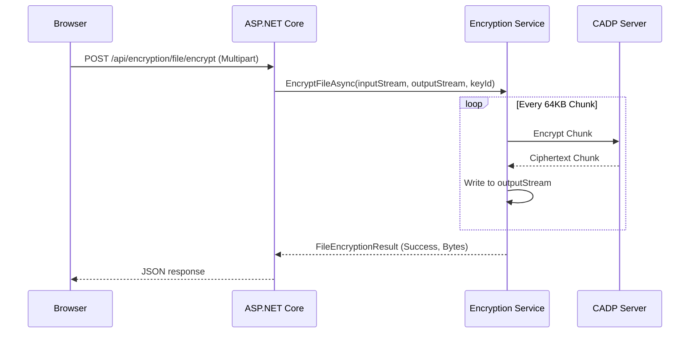

```mermaid
sequenceDiagram
    participant B as Browser
    participant A as ASP.NET Core
    participant E as Encryption Service
    participant C as CADP Server

    B->>A: POST /api/encryption/file/encrypt (Multipart)
    A->>E: EncryptFileAsync(inputStream, outputStream, keyId)
    loop Every 64KB Chunk
        E->>C: Encrypt Chunk
        C-->>E: Ciphertext Chunk
        E->>E: Write to outputStream
    end
    E-->>A: FileEncryptionResult (Success, Bytes)
    A-->>B: JSON response
```
