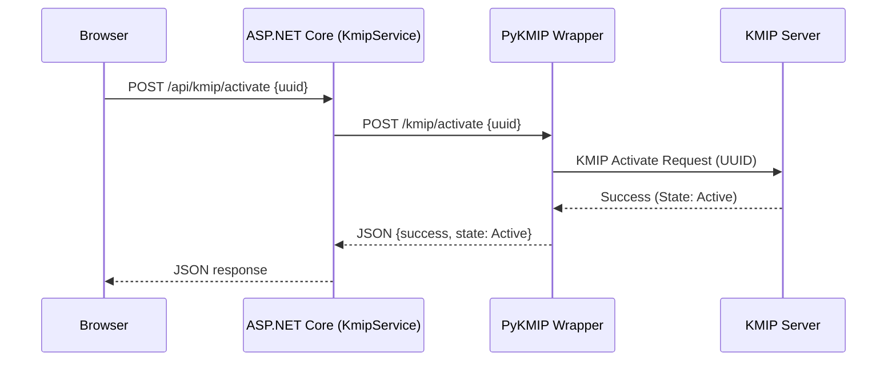

```mermaid
sequenceDiagram
    participant B as Browser
    participant A as ASP.NET Core (KmipService)
    participant P as PyKMIP Wrapper
    participant K as KMIP Server

    B->>A: POST /api/kmip/activate {uuid}
    A->>P: POST /kmip/activate {uuid}
    P->>K: KMIP Activate Request (UUID)
    K-->>P: Success (State: Active)
    P-->>A: JSON {success, state: Active}
    A-->>B: JSON response
```
