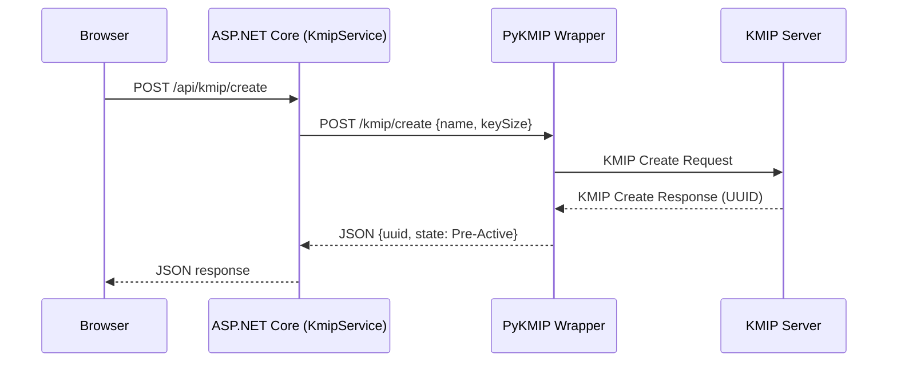

```mermaid
sequenceDiagram
    participant B as Browser
    participant A as ASP.NET Core (KmipService)
    participant P as PyKMIP Wrapper
    participant K as KMIP Server

    B->>A: POST /api/kmip/create
    A->>P: POST /kmip/create {name, keySize}
    P->>K: KMIP Create Request
    K-->>P: KMIP Create Response (UUID)
    P-->>A: JSON {uuid, state: Pre-Active}
    A-->>B: JSON response
```
