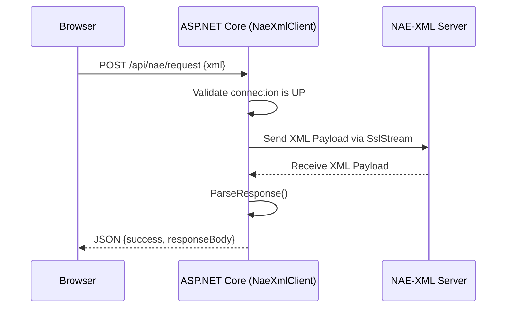

```mermaid
sequenceDiagram
    participant B as Browser
    participant A as ASP.NET Core (NaeXmlClient)
    participant N as NAE-XML Server

    B->>A: POST /api/nae/request {xml}
    A->>A: Validate connection is UP
    A->>N: Send XML Payload via SslStream
    N-->>A: Receive XML Payload
    A->>A: ParseResponse()
    A-->>B: JSON {success, responseBody}
```
