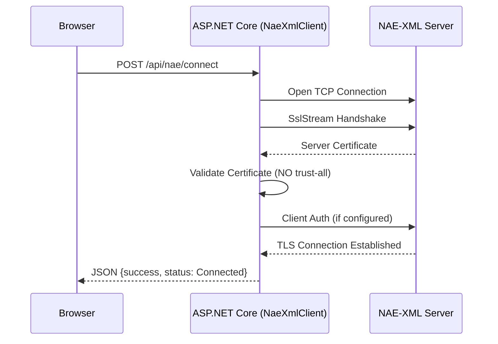

```mermaid
sequenceDiagram
    participant B as Browser
    participant A as ASP.NET Core (NaeXmlClient)
    participant N as NAE-XML Server

    B->>A: POST /api/nae/connect
    A->>N: Open TCP Connection
    A->>N: SslStream Handshake
    N-->>A: Server Certificate
    A->>A: Validate Certificate (NO trust-all)
    A->>N: Client Auth (if configured)
    N-->>A: TLS Connection Established
    A-->>B: JSON {success, status: Connected}
```
