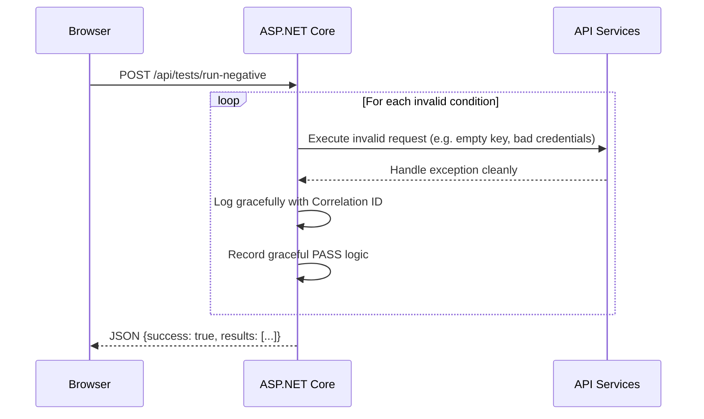

```mermaid
sequenceDiagram
    participant B as Browser
    participant A as ASP.NET Core
    participant S as API Services

    B->>A: POST /api/tests/run-negative
    loop For each invalid condition
        A->>S: Execute invalid request (e.g. empty key, bad credentials)
        S-->>A: Handle exception cleanly
        A->>A: Log gracefully with Correlation ID
        A->>A: Record graceful PASS logic
    end
    A-->>B: JSON {success: true, results: [...]}
```
