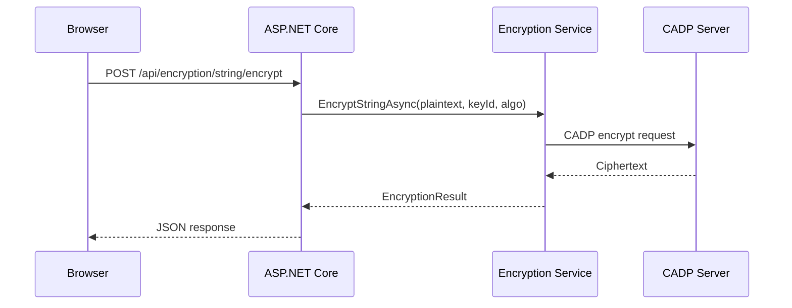

```mermaid
sequenceDiagram
    participant B as Browser
    participant A as ASP.NET Core
    participant E as Encryption Service
    participant C as CADP Server

    B->>A: POST /api/encryption/string/encrypt
    A->>E: EncryptStringAsync(plaintext, keyId, algo)
    E->>C: CADP encrypt request
    C-->>E: Ciphertext
    E-->>A: EncryptionResult
    A-->>B: JSON response
```
